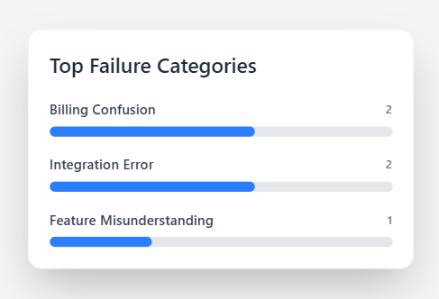
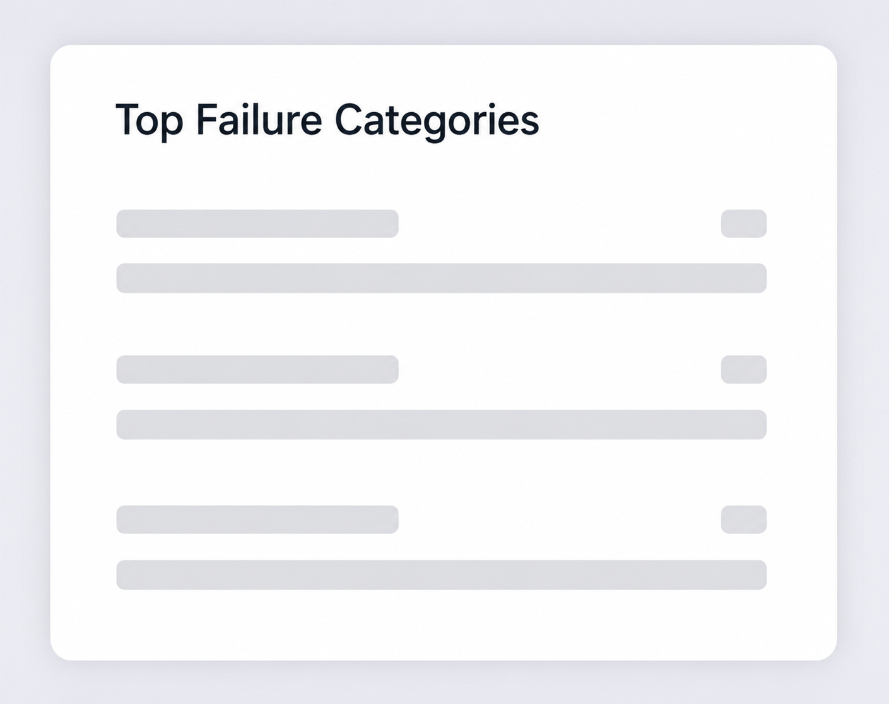
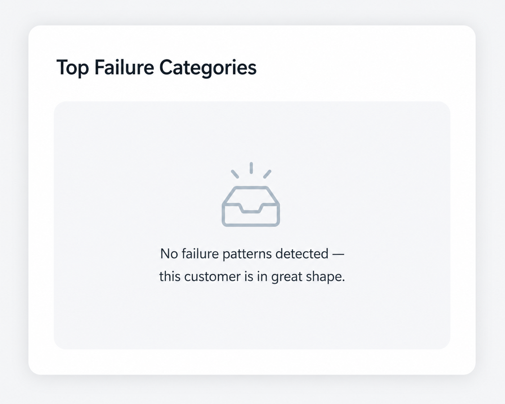

# BlinkGrid Analytics Dashboard

A customer support analytics widget built using React, TypeScript, Express.js, and PostgreSQL.

This project was developed as part of the BlinkGrid engineering assessment task and focuses on identifying recurring unresolved customer issues through analytics-driven insights.

---

# Overview

The dashboard helps account managers proactively identify recurring customer pain points by displaying the top unresolved failure categories for a selected customer.

The application includes:

- Optimized PostgreSQL aggregation query
- Express.js REST API endpoint
- React + TypeScript analytics widget
- Loading, empty, populated, and error UI states
- Responsive modern dashboard interface

---

# Tech Stack

## Frontend
- React
- TypeScript
- Vite
- Tailwind CSS

## Backend
- Node.js
- Express.js

## Database
- PostgreSQL

---

# Features

- Displays top 3 unresolved failure categories
- Optimized SQL query using:
  - JOIN
  - GROUP BY
  - COUNT
  - ORDER BY
  - LIMIT
- Proper NULL filtering
- REST API endpoint integration
- Customer ID validation
- Environment variable configuration
- Loading skeleton UI state
- Empty state handling
- Error state handling
- Responsive SaaS-style analytics widget
- Clean component-based frontend structure

---

# SQL Query

```sql
SELECT
    t.failure_category,
    CAST(COUNT(*) AS INTEGER) AS failure_count
FROM tickets t
JOIN customers c
    ON t.customer_id = c.customer_id
WHERE
    t.customer_id = $1
    AND t.resolved = FALSE
    AND t.failure_category IS NOT NULL
GROUP BY t.failure_category
ORDER BY failure_count DESC
LIMIT 3;
```

---

# API Endpoint

```http
GET /api/analytics/top-failures/:customer_id
```

Example:

```http
GET /api/analytics/top-failures/1
```

---

# API Response Example

```json
[
  {
    "failure_category": "billing_confusion",
    "failure_count": 2
  },
  {
    "failure_category": "integration_error",
    "failure_count": 2
  },
  {
    "failure_category": "feature_misunderstanding",
    "failure_count": 1
  }
]
```

---

# Project Structure

```bash
BlinkGrid_Task/
├── backend/
│   ├── routes/
│   │   └── analytics.js
│   ├── db.js
│   ├── server.js
│   ├── package.json
│   ├── .env.example
│
├── frontend/
│   ├── src/
│   │   ├── components/
│   │   │   └── TopFailuresWidget.tsx
│   │   ├── App.tsx
│   │   └── main.tsx
│
├── screenshots/
│   ├── Populated_State.png
│   ├── Loading_State.png
│   └── Empty_State.png
│
├── README.md
└── .gitignore
```

---

# UI States

## Loading State
Displays animated skeleton loaders while analytics data is being fetched from the backend API.

## Empty State
Displays:

> "No failure patterns detected — this customer is in great shape."

when no unresolved failure categories exist for the selected customer.

## Error State
Displays a user-friendly error message if the API request fails.

## Populated State
Displays the top failure categories along with ticket counts and visual progress indicators.

---

# Screenshots

## Populated State



---

## Loading State



---

## Empty State



---

# Running The Project

## 1. Clone Repository

```bash
git clone https://github.com/Ishita-2210/blinkgrid-analytics-dashboard.git
```

---

## 2. Backend Setup

Navigate to backend:

```bash
cd backend
```

Install dependencies:

```bash
npm install
```

Create a `.env` file inside the backend directory:

```env
DB_USER=postgres
DB_HOST=localhost
DB_NAME=analytics_db
DB_PASSWORD=your_password
DB_PORT=5432
PORT=5000
```

Start backend server:

```bash
npm start
```

Backend runs on:

```bash
http://localhost:5000
```

---

## 3. Frontend Setup

Navigate to frontend:

```bash
cd frontend
```

Install dependencies:

```bash
npm install
```

Create a `.env` file inside the frontend directory:

```env
VITE_API_BASE_URL=http://localhost:5000
```

Start frontend development server:

```bash
npm run dev
```

Frontend runs on:

```bash
http://localhost:5173
```

---

# Database Setup

Create PostgreSQL database:

```sql
CREATE DATABASE analytics_db;
```

Create tables:

```sql
CREATE TABLE customers (
    customer_id SERIAL PRIMARY KEY,
    customer_name TEXT
);

CREATE TABLE tickets (
    ticket_id SERIAL PRIMARY KEY,
    customer_id INT REFERENCES customers(customer_id),
    failure_category TEXT,
    resolved BOOLEAN
);
```

Insert sample data:

```sql
INSERT INTO customers (customer_name)
VALUES ('Acme Corp');

INSERT INTO tickets (customer_id, failure_category, resolved)
VALUES
(1, 'billing_confusion', FALSE),
(1, 'billing_confusion', FALSE),
(1, 'integration_error', FALSE),
(1, 'feature_misunderstanding', FALSE),
(1, 'integration_error', FALSE),
(1, NULL, FALSE),
(1, 'feature_misunderstanding', TRUE);
```

---

# Environment Variables

## Backend `.env`

```env
DB_USER=postgres
DB_HOST=localhost
DB_NAME=analytics_db
DB_PASSWORD=your_password
DB_PORT=5432
PORT=5000
```

---

## Frontend `.env`

```env
VITE_API_BASE_URL=http://localhost:5000
```

---

# Backend Notes

The backend implementation includes:

- PostgreSQL connection pooling
- Parameterized SQL queries
- Customer ID validation
- CORS middleware support
- Environment-based configuration
- Proper NULL filtering
- Aggregation directly within the database layer for optimized analytics performance

---

# Author

**Ishita Sahu**